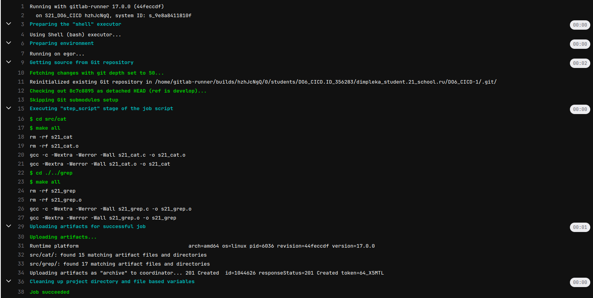

## Part 1. Настройка gitlab-runner

1) Поднимим виртуальную машину Ubuntu Server 22.04 LTS.

- Для удобства подключусь к Виртуальной машине по shh с помощью клиента OpenSSH
- Для этого я изменю тип подключения с «NAT» на «Сетевой мост» и с помощью команды ssh user@ip_user подключусь

2) Скачаю и установлю на виртуальную машину gitlab-runner.

- curl -L https://packages.gitlab.com/install/repositories/runner gitlab-runner/script.deb.sh | sudo bash с помощью этой команды скачаю скрипт, который автоматически добавит репозиторий GitLab Runner в мою систему

- устанвоим gitlab-runner

3) запустим gitlab-runner и зарегистрируем его для использования в текущем проекте (DO6_CICD).

- для регистрации выполню команду: sudo gitlab-runner register

- ввожу туда токе и url указаный на гите 

- заполняю требующиеся поля

- проверю что гитлаб раннер установлен и работает 

## Part 2. Сборка

1) Напишим этап для CI по сборке приложений из проекта C3_SimpleBashUtils.

- Добавим файл .gitlab-ci.yml в корневую часть проекта

- tags: [build] указываем теги по умолчанию
- stages определяет этапы работы CI в нашем случае определен только один этап build
- build_stage: - это название задачи, которая принадлежит этапу build
- далее указывается список команд 
- artifacts: - определяет атефакты, мы указываем путь где они будут храниться и срок хранения (30 дней)

- пайплайн фейлится

- судя по выводу он фейлится из-за того что на виртуалке у нас не стоит make.
- устанавливаю на виртуалку make и gcc 

- пайплайн успешно отрабатывает

## Part 3. Тест кодстайла

1) Напишим этап для CI, который запускает скрипт кодстайла (clang-format).

- добавим в файл .gitlab-ci.yml следующий код

- style_stage: - это название задачи, которая принадлежит этапу style
- добавили скрипт на проверку стиля файлов с расширение .c и .h в директориях cat и grep
- Флаг Werror добавил для того что бы пайплайн фейлился если тест на стиль не прошел 

2) Выполним проеверку корректности работы

- сделаем специально стилевые ошибки в файлах в директории grep

- видим что пайплайн успешно зафейлился и вывел ошибки 

- исправляем ошибки и заново запускаем пайплайн

- видим что все прошло успешно 

## Part 4. Интеграционные тесты

1) Напишим этап для CI, который запускает интеграционные тесты из проекта.

- Добавим стадия тестов 

- ключ needs используется для указания на зависимость этой задачи от успешного завершения предыдущих задач (build_stage и style_stage). 
- в скриптах мы сначала запускаем тесты grep и их вывод записываем в output_grep, затем с помощью grep в выводе находим последнюю строку с результатами и записываем число проваленных тестов в переменную fail_count_grep. По аналогии действуем с тестами для cat. Затем мы проверяем количество ошибок в cat и grep. Если ошибки есть то выводим информацию о их количестве и возвращаем ошибку 1, тем самым фейля пайплайн.

- видно что без ошибок все работает

- попробую добавить ошибку в grep

- видим что прайплайн успешно фейлится 

## Part 5. Этап деплоя

1) Поднимаем вторую виртуальную машину Ubuntu Server 22.04 LTS.

- Для удобства подключусь к Виртуальной машине по shh с помощью клиента OpenSSH
- Для этого я изменю тип подключения с «NAT» на «Сетевой мост» и с помощью команды ssh user@ip_user подключусь. ip_user можно узнать с помощью команды ifconfig

2) Настраиваем SSH и SCP для работы без пароля

- Вместо пароля будем использовать пару ключей шифрования, чтобы сервер-источник файла и сервер-получатель файла знали пользователя и не спрашивали пароль. На сервере-источнике для генерации публичной и приватной пары ключей RSA под нужным нам пользователем (в нашем случае под пользователем gitlab-runner, так как под ним будет происходить копированеи в CICD) выполняем команду: shh-keygen.

- Затем выполним команду scp ~/.ssh/id_rsa.pub deploy@192.168.1.104:~/.ssh/authorized_keys. Эта команда, предназначена для копирования публичного SSH ключа в файл authorized_keys на удалённом сервере с IP адресом 192.168.1.104 (это позволит подключаться к серверу без ввода пароля)

3) Напишим скрипт, который копирует файлы на вторую виртуалку 

4) Вносим изменения в .gitlab-ci.yml

- значение when равное manual означает, что задача не будет запускаться автоматически в рамках пайплайна. Вместо этого она будет ожидать ручного запуска через пользовательский интерфейс GitLab.

5) Запускаем пайплан и убеждаемся что все работает как надо

